# Celeritas

A launcher for the Mac. Press a key, type what you want, get an answer.

Most of what you type never reaches a model. Token prices on Robinhood chain
and Solana, coins, shares, currency, arithmetic, unit conversion, emoji and app
names are answered on your machine from a file, in under a millisecond, for
nothing. A model is asked only when the question needs one, and the row tells
you which model is about to get it before it goes.

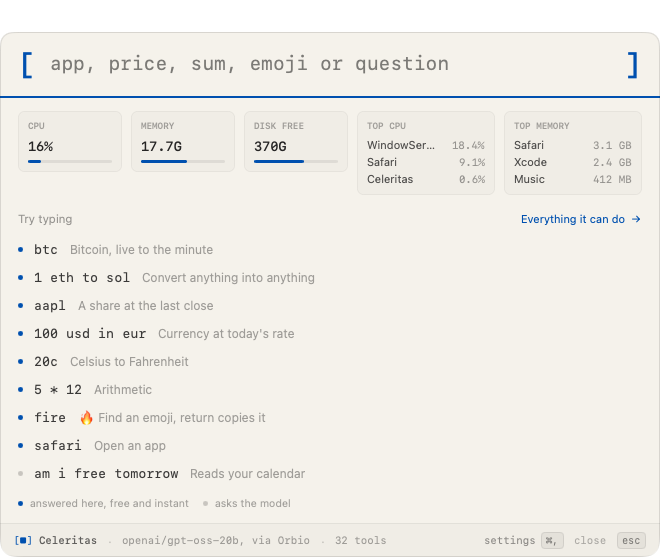

## Install

### Download it

**[Download Celeritas](https://github.com/Celeritylabsco/celeritas/releases/latest)**
and drag it to Applications.

### Check it first

The download is 4 MB. Confirm it is the file we published:

```sh
shasum -a 256 ~/Downloads/Celeritas-*.dmg
```

The number it prints is on the [release page](https://github.com/Celeritylabsco/celeritas/releases/latest).
If it differs by one character, stop. You have a different file from the one we
built.

Paste that same number into [VirusTotal](https://www.virustotal.com/gui/home/search)
and you get a report from around seventy engines without uploading anything,
because the hash identifies the file on its own. Upload the disk image instead
if you would rather.

### The first open needs one extra step

The app is ad-hoc signed, because notarising needs a paid Apple Developer
account and the lab does not have one. We are working on getting one. Until
then Gatekeeper sees an unidentified developer and blocks the first open.

On macOS 26, right click and Open no longer gets past this. There are two ways
through. Either clear the quarantine flag:

```sh
xattr -dr com.apple.quarantine /Applications/Celeritas.app
```

Or open **System Settings**, **Privacy & Security**, scroll to the Security
section, and press **Open Anyway** on the line about Celeritas. That button
appears once you have tried to open the app, so double click it first.

Once is enough either way. macOS remembers.

### Or build it yourself

Better, if you would rather read the code than trust a binary from a stranger.
It takes about thirty seconds.

```sh
git clone https://github.com/Celeritylabsco/celeritas.git
cd celeritas/app
swift build
./Scripts/build-app.sh
open build/Celeritas.app
```

Needs Swift 6.2 and macOS 26. Nothing else, no package manager, no Xcode
project. To make your own disk image:

```sh
./Scripts/make-dmg.sh
```

### Running the tests

```sh
swift run CeleritasKitTests
```

259 checks over the parsing, routing, formatting and storage that everything
else sits on. They are a plain executable rather than XCTest, because XCTest
does not ship with the Command Line Tools, and needing Xcode to run a test
suite is a barrier for a repo this size.

The routing benchmark is the other half of the testing, and it measures which
path answers a query rather than whether a function is correct:

```sh
swift run RoutingBench --spec ../bench/routing.json --out ../bench/results
```

Both commands run from `app/`, where `Package.swift` is, which is why the
benchmark paths climb out of it.

### How the repo is laid out

```
app/Sources/Celeritas/          the app: palette, settings, onboarding, hotkey
app/Sources/CeleritasKit/       everything that is not UI, and the tested half
app/Sources/CeleritasKitTests/  the 259 checks
app/Sources/RoutingBench/       the routing benchmark
app/Sources/AppleShim/          Apple Intelligence behind an OpenAI-shaped
                                endpoint, so the benchmark can score it on the
                                same tasks as every other model
app/Scripts/                    build the .app, the disk image, the icon
bench/                          the model benchmark: tasks, scoring, every run
                                record, and the scripts that made them
runtime/                        the python agent loop the benchmark drives
tools/tools.json                all 32 tools, in full
```

These are the files to read first:

```
app/Sources/CeleritasKit/Results.swift    what happens to every keystroke
app/Sources/CeleritasKit/Executor.swift   how a tool actually runs
app/Sources/CeleritasKit/LabAPI.swift     the only thing it fetches
tools/tools.json                          all 32 tools, in full
```

Four tools can destroy something, and all four ask first. They are marked
`destructive` in `tools.json`: `delete_event`, `move_file`, `trash_file`,
`empty_trash`.

## Setting it up

The first run asks where answers should come from, before anything is sent
anywhere.

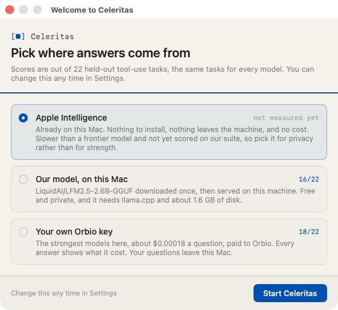

Three choices, and the window shows what each one scored on our benchmark.

| | cost | score | where it runs |
|---|---|---|---|
| Apple Intelligence | free | no score, see below | on your Mac, nothing leaves |
| Our model, on this Mac | free | 16 of 22 | on your Mac, downloaded once, about 1.6 GB |
| **Your own Orbio key** | about $0.00018 a question | 18 of 22, the best here | your question goes to Orbio |

**Apple Intelligence is the weak one.** We could not score it, because its API
cannot carry on after a tool result without a fresh prompt, and a fresh prompt
reads to it as a new and unclear request. So it gives up on every second turn.
One step works and it is quick, about two and a half seconds. Anything needing
two steps stalls. Pick it if you want nothing at all to leave the Mac.

Most people want the Orbio key. [Get one at orbio.so](https://orbio.so), which
takes a minute and needs no card, then paste it in and you are done.

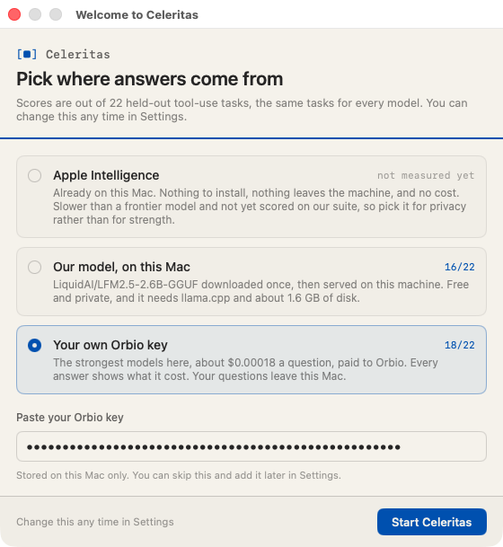

You can change any of it later.

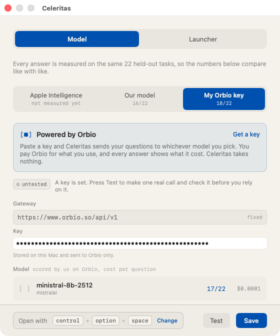

The launcher page controls what the panel shows before you type, and which
tokens sit on it.

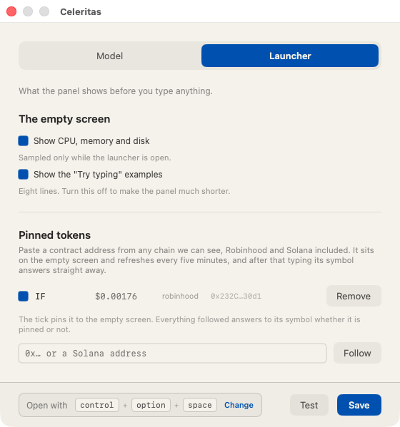

## Crypto

Your Mac works all of this out on its own, from a table already on disk, in
under a millisecond, with no model and no key involved.

### Any token on Robinhood or Solana

Paste a contract address from either chain, or type the name of one you follow.

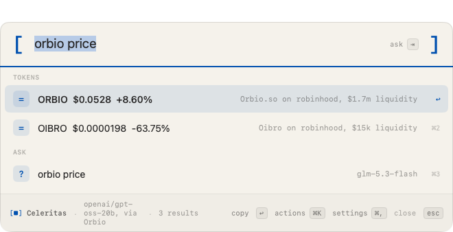

Every row carries the pool liquidity, which is how you spot a copycat. Anyone
can take a ticker. Nobody can fake a deep pool.

### Coins, live to the minute

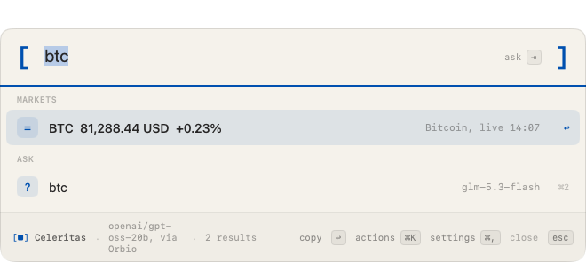

### Anything into anything

Coin to coin, coin to a currency, a share into a coin. The tag names the stalest
side, so you always know how old the answer is.

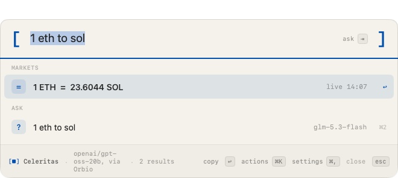

### Pin what you watch

Tokens you pin sit on the panel before you type anything, priced on open. Set
them on the launcher page in settings.

### What we see of what you look up

Prices arrive as one whole table, so we never see which coin you looked at or
which pair you converted. A token lookup by address is the one exception,
because answering "what is this contract" means telling us the contract. That
address is cached for five minutes and never logged.

## What else you can type

Shares, at the last close.

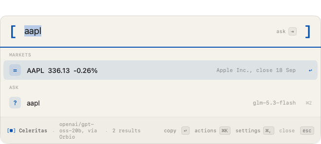

Currency, at today's published rate.

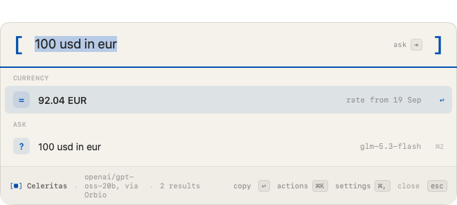

Units, offline. Seven kinds, about ninety spellings.

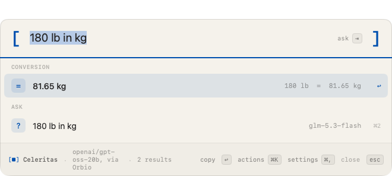

Arithmetic, with brackets and powers.

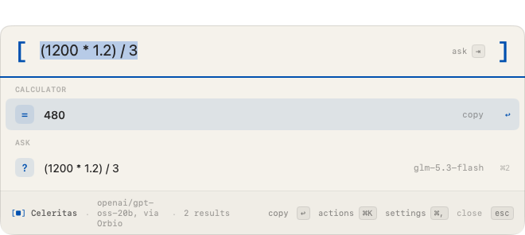

Emoji, 3,963 of them, offline. Return copies the character.

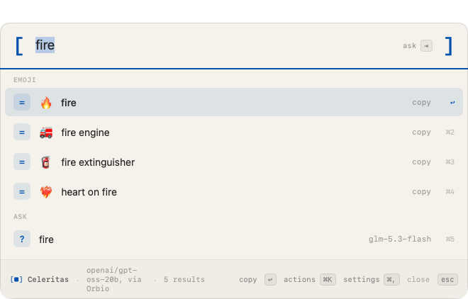

Apps, by name or by initials.

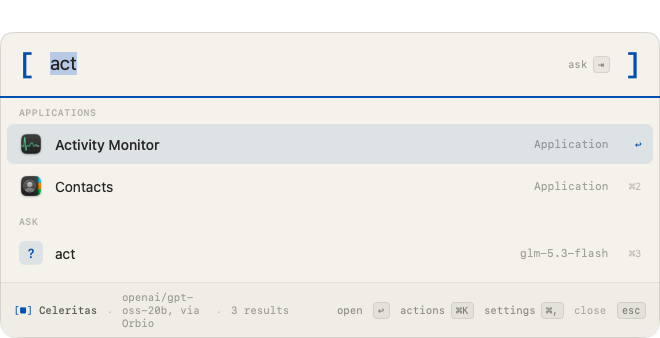

Your machine: battery, disk, memory, wifi, and what is using the processor.

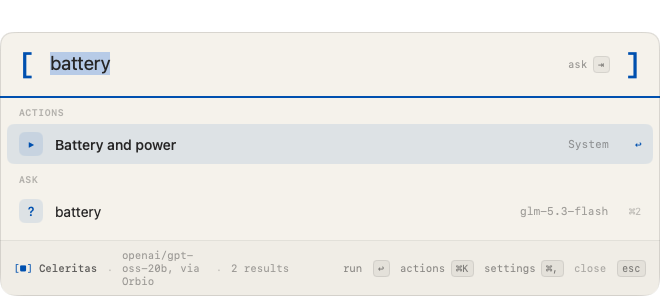

Then the questions that need a model. Your calendar, your mail, your reminders,
your files. The row says which model will get the question.

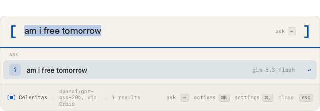

Press return and it runs, then tells you what it did, what it cost and how long
it took.

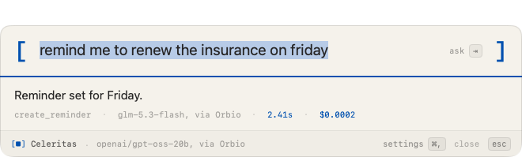

## Why a lab built a launcher

Celerity Labs is a public lab. We measure what AI agents can actually do, and we
publish the runs.

This app started as a test rig. The question was narrow: for an agent holding
about thirty tools on a desktop, which small model picks the right one? There
was no way to answer that without building the agent, so we built the agent,
wrote 85 tasks and ran fourteen models. The rig turned out to be worth using
every day.

What we hold ourselves to, and you can check every line of it in this repo:

- Every number we publish comes out of a run record. None are typed in by hand.
  The records are in `bench/results` and on Hugging Face.
- We publish the results that cost us something. The model this app shipped with
  came first on the 55 tasks we had been tuning against, and eighth on the 22 we
  held back. We changed the default and wrote up the fall.
- Nothing here sits behind an account. MIT for the code, CC BY 4.0 for the data,
  no sign-up, no telemetry, no cut of anything you spend.

## Powered by Orbio

[Orbio](https://orbio.so) is the gateway behind the best answers Celeritas
gives.

Paste an Orbio key in settings and Celeritas sends your question to whichever
model you pick. You pay Orbio for what you use, every answer shows what it cost,
and **Celeritas takes nothing**. We add no markup and you never make an account
with us. The key is stored on your Mac and sent to Orbio only.

Orbio also made this project's benchmark possible. Every one of the fourteen
models we measured, across 45 runs and 1,457 scored attempts, was reached
through one Orbio key on one OpenAI-shaped endpoint. Comparing a dozen vendors
fairly usually means opening a dozen accounts against a dozen slightly different
APIs. This took one.

[Get a key](https://orbio.so). It takes a minute and needs no card.

## The benchmark

Choosing the model meant measuring them, so the suite, the harness and every
run record are in `bench/`.

**Tool choice.** 85 tasks on a simulated Mac. Scoring reads the end state of
that Mac, so a model gets no credit for describing the right action. The tasks
split into 55 we looked at while tuning and 22 held back. Every model scored 5
to 23 points lower on the held-out half, and the ordering changed enough to move
the model this app used to ship with from first to eighth.

**Routing.** 52 cases that measure this launcher's own code: which of about ten
paths answers a query, and for the 23 with one right answer, whether the answer
is right. It found two bugs the first time it ran.

```sh
python3 bench/run.py --model <id> --split heldout
(cd app && swift run RoutingBench --spec ../bench/routing.json --out ../bench/results)
```

The write-up is at [celeritylabs.co/notes/tool-choice](https://celeritylabs.co/notes/tool-choice).
The data is on
[Hugging Face](https://huggingface.co/datasets/celerity-labs/celeritybench-tool-choice),
CC BY 4.0. If you publish a number from it, say which split it came from.

## What it sends, and where

Worth being exact, since it reads your calendar and your mail.

Nothing leaves your Mac unless you ask a model a question. Prices, rates and
emoji are files downloaded from `celeritylabs.co`, and the whole table comes
down at once, so the app never tells us the thing you typed. We never learn
which pair you converted or which share you looked up.

A token lookup is the one exception. Answering "what is this contract" means
telling us which contract, so that address passes through our server. It is
cached for five minutes and not logged.

Your calendar, mail, files and reminders never go anywhere except to the model
you chose, when you press return on a question that needs it, and only the part
of them that answers your question.

Pinned tokens, your hotkey and your key stay on your Mac, in the same place
macOS keeps every app's preferences. There is no account.

## Licence

MIT for the code. The benchmark dataset is CC BY 4.0.

Built by [Celerity Labs](https://celeritylabs.co).
